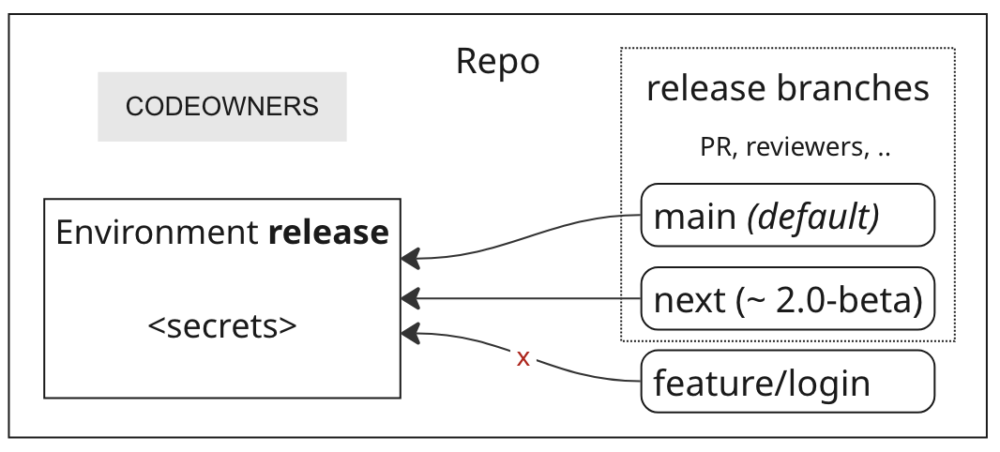

[](https://registry.terraform.io/modules/agilecustoms/repo/github/latest)
[](https://github.com/agilecustoms/terraform-github-repo/blob/main/LICENSE)

# About

Creates a GitHub repository with _release_ environment and protected branches that can access secrets in this environment.
This is an ideal setup for most repositories that follow PR-based development with automated releases from protected branches.
Works best with GitHub action [agilecustoms/release](https://github.com/agilecustoms/release)



## Highlights

Create a GitHub repository with security best practices:
- default branch (`main` by default)
- `release` environment - hold secrets used in release workflow (when you create version and publish it)
- release branches — branches that have access to `release` environment (`main` by default)
- developers cannot create/modify/delete tags (to protect release tags)
- admins must approve any changes in `.github` (to protect leaks of secrets in workflows)

## Usage

```hcl
module "repo_my_app" {
  source = "agilecustoms/repo/github"

  name             = "my-app"
  description      = "Repo description"
  visibility       = "private" # default
  release_branches = ["main", "next", "legacy"] # default is ["main"]
  reviewers_github = ["<gh-org-name>/ci-admins"] # here ci-admins is an example, can be any team(s) or user(s)
  release_environment_secrets = {
    # any secrets to access artifact store, plus GH PAT to make automated commit/tag during release workflow
    GH_TOKEN = var.gh_token
  }

  # if your repo is a GitHub Action and needs to be accessible from other corporate repos
  actions_repository_access_level = "organization"
}
```

To start managing an existing repo, import it first:
```shell
terraform import 'module.repo_my_app.github_repository.repo' my-app
# if there is already a CODEOWNERS file in the repo, import it too:
terraform import 'module.repo_my_app.github_repository_file.codeowners[0]' my-app/.github/CODEOWNERS
```

## Requirements

| Name      | Version   |
|-----------|-----------|
| terraform | >= 1.5.7  |
| github    | >= 4.26.0 |

## Providers

| Name   | Version   |
|--------|-----------|
| github | >= 4.26.0 |

## Modules

No modules

## Resources

| Name                                                                                                                                                                                  | Type     |
|---------------------------------------------------------------------------------------------------------------------------------------------------------------------------------------|----------|
| [github_repository.repo](https://registry.terraform.io/providers/integrations/github/latest/docs/resources/repository)                                                                | resource |
| [github_actions_repository_access_level.access](https://registry.terraform.io/providers/integrations/github/latest/docs/resources/actions_repository_access_level)                    | resource |
| [github_branch.default](https://registry.terraform.io/providers/integrations/github/latest/docs/resources/branch)                                                                     | resource |
| [github_branch_default.it](https://registry.terraform.io/providers/integrations/github/latest/docs/resources/branch_default)                                                          | resource |
| [github_repository_file.codeowners](https://registry.terraform.io/providers/integrations/github/latest/docs/resources/repository_file)                                                | resource |
| [github_repository_ruleset.branches](https://registry.terraform.io/providers/integrations/github/latest/docs/resources/repository_ruleset)                                            | resource |
| [github_repository_ruleset.tags](https://registry.terraform.io/providers/integrations/github/latest/docs/resources/repository_ruleset)                                                | resource |
| [github_repository_environment.release](https://registry.terraform.io/providers/integrations/github/latest/docs/resources/repository_environment)                                     | resource |
| [github_actions_environment_secret.release](https://registry.terraform.io/providers/integrations/github/latest/docs/resources/actions_environment_secret)                             | resource |
| [github_repository_environment_deployment_policy.release](https://registry.terraform.io/providers/integrations/github/latest/docs/resources/repository_environment_deployment_policy) | resource |

## Inputs

Important inputs are marked with **bold**. The rest should be good by default

| Name                                    | Default                       | Description                                                                                                                                                                                                                                                                                                                                                                                                                                                                |
|-----------------------------------------|-------------------------------|----------------------------------------------------------------------------------------------------------------------------------------------------------------------------------------------------------------------------------------------------------------------------------------------------------------------------------------------------------------------------------------------------------------------------------------------------------------------------|
| **actions_repository_access_level**     |                               | Allows to set the access level of a non-public repositories actions and reusable workflows for use in other repositories                                                                                                                                                                                                                                                                                                                                                   |
| allow_auto_merge                        | _true_                        | Allow auto-merging pull requests on the repository                                                                                                                                                                                                                                                                                                                                                                                                                         |
| allow_merge_commit                      | _true_                        | Set to false to disable merge commits on the repository                                                                                                                                                                                                                                                                                                                                                                                                                    |
| allow_rebase_merge                      | _true_                        | Set to false to disable rebase merges on the repository                                                                                                                                                                                                                                                                                                                                                                                                                    |
| allow_squash_merge                      | _true_                        | Set to false to disable squash merges on the repository                                                                                                                                                                                                                                                                                                                                                                                                                    |
| allow_update_branch                     |                               | Set to true to always suggest updating pull request branches                                                                                                                                                                                                                                                                                                                                                                                                               |
| archive_on_destroy                      | _true_                        | Archive the repository instead of deleting on destroy                                                                                                                                                                                                                                                                                                                                                                                                                      |
| archived                                | _false_                       | Specifies if the repository should be archived. Defaults to false. NOTE Currently, the API does not support unarchiving                                                                                                                                                                                                                                                                                                                                                    |
| **bypass_actors**                       | { "0" = "OrganizationAdmin" } | Actor_id => actor (role, team or app). Actors allowed to bypass branch/tag protection rules to make automated commit with version bump in release workflows                                                                                                                                                                                                                                                                                                                |
| commit_author                           |                               | Committer author name to use. NOTE: GitHub app users may omit author and email information so GitHub can verify commits as the GitHub App. This maybe useful when a branch protection rule requires signed commits                                                                                                                                                                                                                                                         |
| commit_email                            |                               | Committer email address to use. NOTE: GitHub app users may omit author and email information so GitHub can verify commits as the GitHub App. This may be useful when a branch protection rule requires signed commits                                                                                                                                                                                                                                                      |
| codeowners_commit_message               | (see description)             | Default: "Admins must approve any changes in .github dir \[skip ci]"                                                                                                                                                                                                                                                                                                                                                                                                       |
| delete_branch_on_merge                  | _true_                        | Automatically delete head branch after a pull request is merged                                                                                                                                                                                                                                                                                                                                                                                                            |
| **default_branch**                      | main                          | This branch will be created and marked as default for the repo                                                                                                                                                                                                                                                                                                                                                                                                             |
| **description**                         |                               | A description of the repository                                                                                                                                                                                                                                                                                                                                                                                                                                            |
| gitignore_template                      |                               | Use the [name of the template](https://github.com/github/gitignore) without the extension. For example, "Haskell"                                                                                                                                                                                                                                                                                                                                                          |
| has_discussions                         |                               | Set to true to enable the GitHub Discussions on the repository                                                                                                                                                                                                                                                                                                                                                                                                             |
| has_issues                              |                               | Set to true to enable the GitHub Issues features on the repository                                                                                                                                                                                                                                                                                                                                                                                                         |
| has_projects                            |                               | Set to _true_ to enable the GitHub Projects features on the repository                                                                                                                                                                                                                                                                                                                                                                                                     |
| has_wiki                                | _false_                       | Set to _true_ to enable the GitHub Wiki features on the repository                                                                                                                                                                                                                                                                                                                                                                                                         |
| homepage_url                            |                               | URL of a page describing the project                                                                                                                                                                                                                                                                                                                                                                                                                                       |
| ignore_vulnerability_alerts_during_read |                               | Set to true to not call the vulnerability alerts endpoint so the resource can also be used without admin permissions during read                                                                                                                                                                                                                                                                                                                                           |
| is_template                             | _false_                       | Set to true to tell GitHub that this is a template repository                                                                                                                                                                                                                                                                                                                                                                                                              |
| license_template                        |                               | Use the [name of the template](https://github.com/github/choosealicense.com/tree/gh-pages/_licenses) without the extension. For example, "mit" or "mpl-2.0"                                                                                                                                                                                                                                                                                                                |
| merge_commit_message                    |                               | Can be `PR_BODY`, `PR_TITLE`, or `BLANK` for a default merge commit message. Applicable only if `allow_merge_commit` is `true`                                                                                                                                                                                                                                                                                                                                             |
| merge_commit_title                      |                               | Can be `PR_TITLE` or `MERGE_MESSAGE` for a default merge commit title. Applicable only if `allow_merge_commit` is `true`                                                                                                                                                                                                                                                                                                                                                   |
| merge_queue                             | _false_                       | Allow to enable merge queue, see inputs with `merge_queue_` prefix                                                                                                                                                                                                                                                                                                                                                                                                         |
| **name**                                |                               | Repository name                                                                                                                                                                                                                                                                                                                                                                                                                                                            |
| release_branch_pattern                  |                               | Alternative to `release_branches`. Only works for Enterprise. If specified, the `release_branches` ignored. Must also specify `release_branch_operator`                                                                                                                                                                                                                                                                                                                    |
| release_branch_operator                 |                               | The operator to use for matching. Can be one of: `starts_with`, `ends_with`, `contains`, `regex`                                                                                                                                                                                                                                                                                                                                                                           |
| **release_branches**                    | \[main]                       | Protected branches that take changes only via PRs. Get 'release' environment associated — to access GitHub PAT to make automated commit/tag during release workflow. Branches in this list not have to exist at the moment of this terraform module creation                                                                                                                                                                                                               |
| **release_environment**                 | _true_                        | Create 'release' environment - primarily to store GH_TOKEN PAT that can bypass branch/tag protection rules to make automated commit/tag during release workflow                                                                                                                                                                                                                                                                                                            |
| **release_environment_secrets**         |                               | Secrets key => value. secrets to be placed in 'release' environment. Example: `{ GH_TOKEN = var.github_token }`                                                                                                                                                                                                                                                                                                                                                            |
| require_code_owner_review               | _true_                        | Require an approving review in pull requests that modify files that have a designated code owner                                                                                                                                                                                                                                                                                                                                                                           |
| require_last_push_approval              | _true_                        | Whether the most recent reviewable push must be approved by someone other than the person who pushed it                                                                                                                                                                                                                                                                                                                                                                    |
| required_linear_history                 |                               | Prevent merge commits from being pushed to matching branches                                                                                                                                                                                                                                                                                                                                                                                                               |
| required_approving_review_count         | 1                             | The number of approving reviews that are required before a pull request can be merged                                                                                                                                                                                                                                                                                                                                                                                      |
| required_review_thread_resolution       | _true_                        | All conversations on code must be resolved before a pull request can be merged                                                                                                                                                                                                                                                                                                                                                                                             |
| required_signatures                     | _true_                        | Commits pushed to matching branches must have verified signatures                                                                                                                                                                                                                                                                                                                                                                                                          |
| **reviewers_github**                    |                               | List of GitHub usernames (or teams) to add as `CODEOWNERS` for `.github/` files. Recommended to use a team, but can be individual users. Empty array to skip `.github/` reviewers. Do not override `CODEOWNERS` if it already exist. Future changes in `CODEOWNERS` do not cause drift detection                                                                                                                                                                           |
| ruleset_enforcement                     | active                        | Possible values for Enforcement are `disabled`, `active`, `evaluate`. Note: `evaluate` is currently only supported for owners of type `organization`                                                                                                                                                                                                                                                                                                                       |
| squash_merge_commit_message             |                               | Can be `PR_BODY`, `COMMIT_MESSAGES`, or `BLANK` for a default squash merge commit message. Applicable only if `allow_squash_merge` is `true`                                                                                                                                                                                                                                                                                                                               |
| squash_merge_commit_title               |                               | Can be `PR_TITLE` or `COMMIT_OR_PR_TITLE` for a default squash merge commit title. Applicable only if `allow_squash_merge` is `true`                                                                                                                                                                                                                                                                                                                                       |
| topics                                  |                               | The list of topics of the repository                                                                                                                                                                                                                                                                                                                                                                                                                                       |
| **visibility**                          | private                       | Repository visibility: public, private or internal                                                                                                                                                                                                                                                                                                                                                                                                                         |
| vulnerability_alerts                    |                               | Set to true to enable security alerts for vulnerable dependencies (Repo tab "Security" > "Dependabot alerts"). Enabling requires alerts to be enabled on the owner level. (Note for importing: GitHub enables the alerts on public repos but disables them on private repos by default.) See GitHub Documentation for details. Note that vulnerability alerts have not been successfully tested on any GitHub Enterprise instance and may be unavailable in those settings |
| web_commit_signoff_required             | _false_                       | Require contributors to sign off on web-based commits                                                                                                                                                                                                                                                                                                                                                                                                                      |

## Inputs groups

| Name                                                         | Default  | Description                                                                                                                                                                                                                                                                             |
|--------------------------------------------------------------|----------|-----------------------------------------------------------------------------------------------------------------------------------------------------------------------------------------------------------------------------------------------------------------------------------------|
| **merge queue** inputs:                                      |          |                                                                                                                                                                                                                                                                                         |
| merge_queue_check_response_timeout_minutes                   | 60       | Maximum time for a required status check to report a conclusion. After this much time has elapsed, checks that have not reported a conclusion will be assumed to have failed                                                                                                            |
| merge_queue_grouping_strategy                                | ALLGREEN | When set to `ALLGREEN`, the merge commit created by merge queue for each PR in the group must pass all required checks to merge. When set to `HEADGREEN`, only the commit at the head of the merge group must pass its required checks to merge. Can be one of: `ALLGREEN`, `HEADGREEN` |
| merge_queue_max_entries_to_build                             | 5        | Limit the number of queued pull requests requesting checks and workflow runs at the same time                                                                                                                                                                                           |
| merge_queue_max_entries_to_merge                             | 5        | Limit the number of queued pull requests requesting checks and workflow runs at the same time                                                                                                                                                                                           |
| merge_queue_merge_method                                     | MERGE    | Method to use when merging changes from queued pull requests. Can be one of: `MERGE`, `SQUASH`, `REBASE`                                                                                                                                                                                |
| merge_queue_min_entries_to_merge                             | 1        | The minimum number of PRs that will be merged together in a group                                                                                                                                                                                                                       |
| merge_queue_min_entries_to_merge_wait_minutes                | 5        | The time merge queue should wait after the first PR is added to the queue for the minimum group size to be met. After this time has elapsed, the minimum group size will be ignored and a smaller group will be merged.                                                                 |
| **pages** inputs:                                            |          |                                                                                                                                                                                                                                                                                         |
| pages_build_type                                             |          | The type of GitHub Pages site to build. Can be `legacy` or `workflow`. If you use `legacy` as build type you need to set the option `source`                                                                                                                                            |
| pages_cname                                                  |          | The custom domain for the repository. This can only be set after the repository has been created                                                                                                                                                                                        |
| pages_source_branch                                          |          | The repository branch used to publish the site's source files. (i.e. `main` or `gh-pages`)                                                                                                                                                                                              |
| pages_source_path                                            | /        | The repository directory from which the site publishes                                                                                                                                                                                                                                  |
| **code scanning** inputs:                                    |          |                                                                                                                                                                                                                                                                                         |
| required_code_scanning_alerts_threshold                      |          | The severity level at which code scanning results that raise alerts block a reference update. Can be one of: `none`, `errors`, `errors_and_warnings`, `all`                                                                                                                             |
| required_code_scanning_security_alerts_threshold             |          | The severity level at which code scanning results that raise security alerts block a reference update. Can be one of: `none`, `critical`, `high_or_higher`, `medium_or_higher`, `all`                                                                                                   |
| required_code_scanning_tool                                  |          | The name of a code scanning tool                                                                                                                                                                                                                                                        |
| **security and analysis** inputs:                            |          |                                                                                                                                                                                                                                                                                         |
| security_and_analysis_advanced_security_status               |          | Set to enabled to enable advanced security features on the repository. Can be `enabled` or `disabled`                                                                                                                                                                                   |
| security_and_analysis_secret_scanning_push_protection_status |          | Set to enabled to enable secret scanning push protection on the repository. Can be enabled or disabled. If set to enabled, the repository's `visibility` must be `public` or `security_and_analysis_advanced_security_status` must also be set to `enabled`                             |
| security_and_analysis_secret_scanning_status                 |          | Set to enabled to enable secret scanning on the repository. Can be `enabled` or `disabled`. If set to `enabled`, the repository's `visibility` must be `public` or `security_and_analysis_advanced_security_status` must also be set to `enabled`                                       |
| **template** inputs:                                         |          |                                                                                                                                                                                                                                                                                         |
| template_owner                                               |          | The GitHub organization or user the template repository is owned by                                                                                                                                                                                                                     |
| template_repository                                          |          | The name of the template repository                                                                                                                                                                                                                                                     |
| template_include_all_branches                                | _false_  | Whether the new repository should include all the branches from the template repository (defaults to _false_, which includes only the default branch from the template)                                                                                                                 |

## Outputs

| Name | Description      |
|------|------------------|
| id   | GitHub repo id   |
| name | GitHub repo name |

## Authors

Module is maintained by [Alexey Chekulaev](https://github.com/laxa1986)

## License

Apache 2 Licensed. See [LICENSE](https://github.com/agilecustoms/terraform-github-repo/blob/main/LICENSE) for full details

## Copyright

Copyright 2025 [Alexey Chekulaev](https://github.com/laxa1986)
